# Дипломный проект по UI-автотестированию интернет-магазина [Tasty Coffee](https://shop.tastycoffee.ru/)

<div align="center">
  <a href="https://shop.tastycoffee.ru/">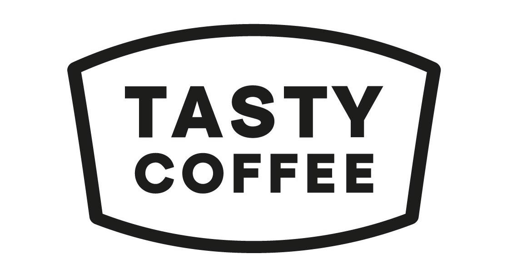</a>
</div>

## Содержание:

* <a href="#annotation">Описание</a>
* <a href="#tools">Технологии и инструменты</a>
* <a href="#cases">Тест кейсы</a>
* <a href="#properties">Работа с properties-файлами</a>
* <a href="#console">Запуск тестов из терминала</a>
* <a href="#jenkins">Запуск тестов в Jenkins</a>
* <a href="#allure">Отчеты в Allure</a>
* <a href="#testops">Интеграция с Allure TestOps</a>
* <a href="#jira">Интеграция с Jira</a>
* <a href="#telegram">Уведомления в Telegram с использованием бота</a>
* <a href="#video">Пример прогона теста в Selenoid</a>

<a id="annotation"></a>
## Описание
Тестовый проект состоит из веб-тестов UI.

Краткий список интересных фактов о проекте:
- [x] `Page Object` проектирование
- [x] Возможность локального и удалённого запуска тестов
- [x] Возможность запуска как всех тестов, так и отдельно по каждому определенному тегу
- [x] Использование `Faker` для генерации данных
- [x] Интеграция с `Allure TestOps`
- [x] Возможность запуска тестов напрямую из `Allure TestOps`
- [x] Интеграция с `Jira`
- [x] Автотесты оформлены как тестовая документация посредством аннотаций `Allure`

<a id="tools"></a>
## Технологии и инструменты

<div align="center">
<a href="https://www.jetbrains.com/idea/"></a>
<a href="https://github.com/"></a>  
<a href="https://www.java.com/"></a>
<a href="https://gradle.org/"></a>  
<a href="https://junit.org/junit5/"></a>
<a href="https://selenide.org/"></a>
<a href="https://aerokube.com/selenoid/"></a>
<a href="https://www.jenkins.io/"></a>
<a href="https://github.com/allure-framework/"></a>
<a href="https://qameta.io/"></a>
<a href="https://www.atlassian.com/software/jira"></a>  
<a href="https://telegram.org/"></a>
</div>

<code>Java</code> - основной язык проекта.\
<code>Selenide</code> - используемый фреймворк. \
<code>Gradle</code> — используется как инструмент автоматизации сборки.\
<code>JUnit5</code> — фреймворк модульного тестирования для выполнения тестов.\
<code>Selenoid</code> — для удаленного запуска браузера в Docker контейнерах.\
<code>Jenkins</code> — CI/CD для запуска тестов удаленно.\
<code>Allure Report</code> — для визуализации результатов тестирования.\
<code>Allure TestOps</code> — как система управления тестированием.\
<code>Telegram Bot</code> — для уведомлений о результатах тестирования.\
<code>Jira</code> — как инструмент управления проектом и таск-трекер.

**Allure Report**, **AllureTestOps** и **Telegram Bot** используются для визуализации результатов тестирования.

Allure-отчет включает в себя:
* шаги выполнения тестов;
* скриншот страницы в браузере в момент окончания автотеста;
* Page Source;
* логи браузерной консоли;
* видео выполнения автотеста.

<a id="cases"></a>
## Тест кейсы

Проект содержит следующие автоматизированные кейсы:
- События вызванные нажатием кнопки "Купить" на странице товара
- Добавление товара в корзину
- Очищение корзины
- Выбор варианта помола кофе
- Аутентификация пользователя с корректными данными
- Отказ пользователю в аутентификации
- Редактирование личных данных пользователя
- Редактирование аватара пользователя 

А также следующие ручные кейсы:
- Добавление товара в избранное

<a id="properties"></a>
## Properties-файлы
Для запуска тестов на локальной машине необходимо создать в папке resources -> config следующие файлы:
- <code>auth.properties</code> - файл с кредами пользователя сайта tastycoffe.ru. Креды понадобятся при запуске тестов на авторизацию, редактирование профиля и редактирование аватара пользователя.\
В файле необходимо указать следующие данные в формате:
```bash
email=ваш email-адрес
password=ваш пароль
```
- <code>selenoid.properties</code> - файл с доступами к удаленному Selenoid-контейнеру. Он понадобится для запуска тестов на удаленном сервере Selenoid из терминала вашей IDEA. 
В файле необходимо указать следующие данные в формате:
```bash
url=адрес вашего Selenoid
login=логин от вашего Selenoid
password=пароль от вашего Selenoid
```

<a id="console"></a>
##  Запуск тестов из терминала
Для запуска тестов из терминала используйте следующие команды:
### Локальный запуск тестов
Все тесты запустятся локально на вашей машине с дефолтными настройками файла WebDriverConfig.
```bash
./gradlew clean test
```

### Удаленный запуск тестов
Тесты запустятся на удаленном сервере Selenoid.
```bash
./gradlew clean test -DisRemote=true
```

### Вы можете корректировать параметры запуска тестов, редактируя и передавая в консоль следующие конфигурации:

> `-Dbrowser=` - наименование браузера (_по умолчанию - <code>chrome</code>_).
>
> `-DbrowserSize=` - размер окна браузера (_по умолчанию - <code>1980x1080</code>_).
>
> `-Dversion` - номер версии браузера (_по умолчанию - <code>115.0</code>_).

Например:
```bash
./gradlew clean test -Dbrowser=FIREFOX -DbrowserSize=1240x960 -Dversion=116
```

<a id="jenkins"></a>
## Запуск тестов в [Jenkins](https://jenkins.autotests.cloud/job/final_project_tastycoffee_web/)
Сборка с параметрами позволяет перед запуском изменить параметры для сборки (путем выбора из списка или прямым указанием значения).
<p align="center">
  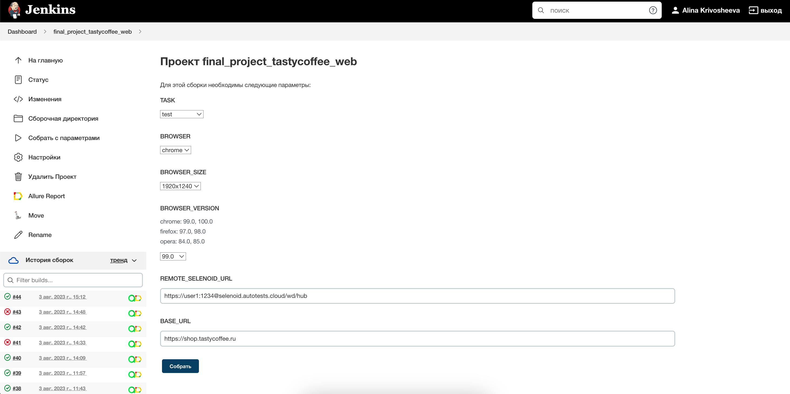
</p>

После выполнения сборки в блоке <code>История сборок</code> напротив номера сборки появится
значки *Allure Report* и *Allure TestOps*, клик по которым позволит ознакомиться с более детальными отчетами о пройденных тестах.

<a id="allure"></a>
## Отчет в [Allure Report](https://jenkins.autotests.cloud/job/final_project_tastycoffee_web/44/allure/)
### Основной дашборд
<p align="center">
  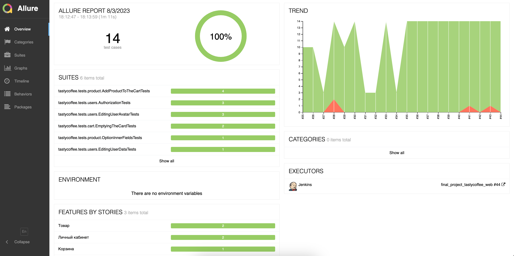
</p>

### Тесты
<p align="center">
  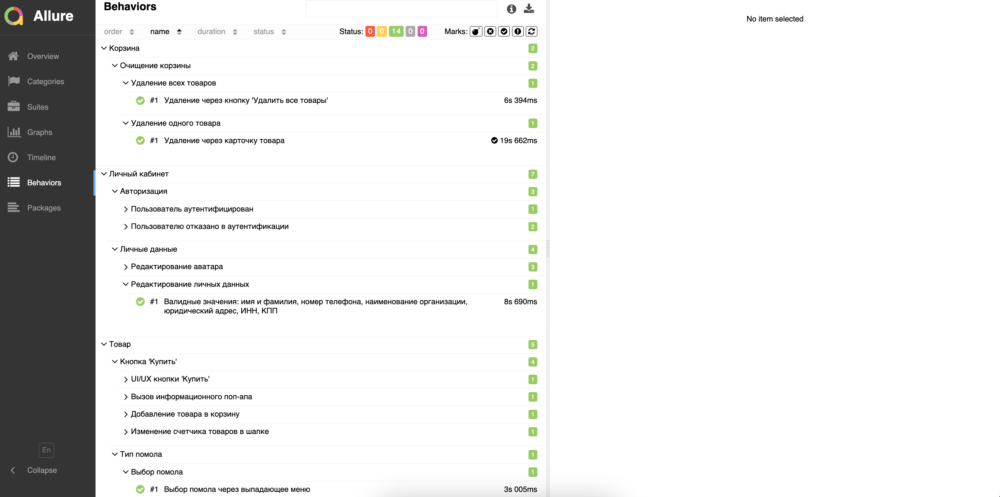
</p>

### Графики
<p align="center">
  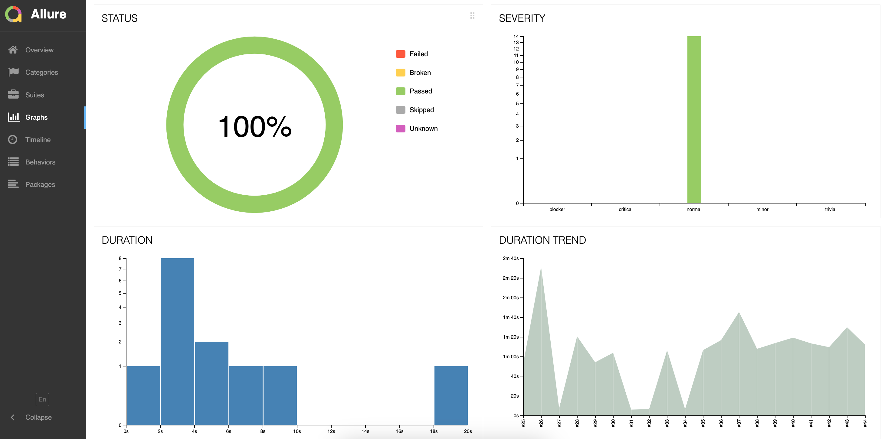
</p>

<a id="testops"></a>
##  Интеграция с [Allure TestOps](https://allure.autotests.cloud/launch/28349)

### Основной дашборд

<p align="center">
  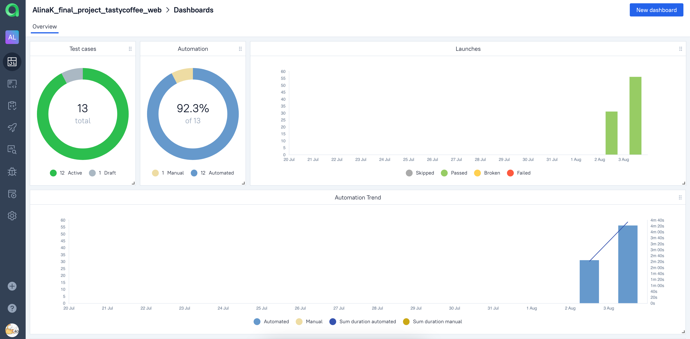
</p>

### Автоматизированные тест-кейсы

<p align="center">
  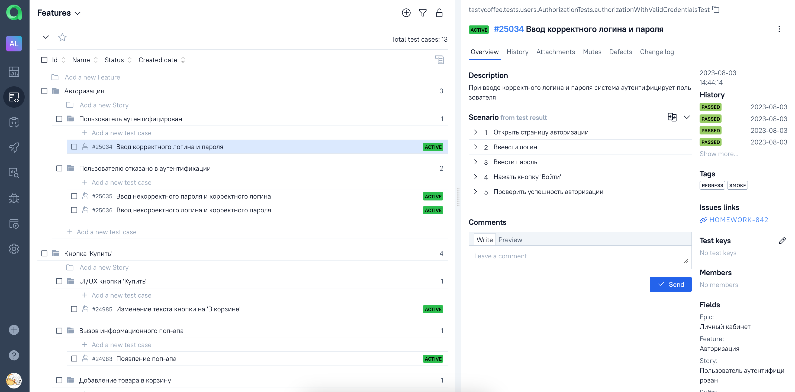
</p>

### Пример мануального тест-кейса

<p align="center">
  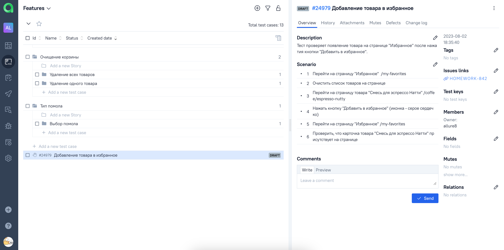
</p>

### Запуски сборок 

<p align="center">
  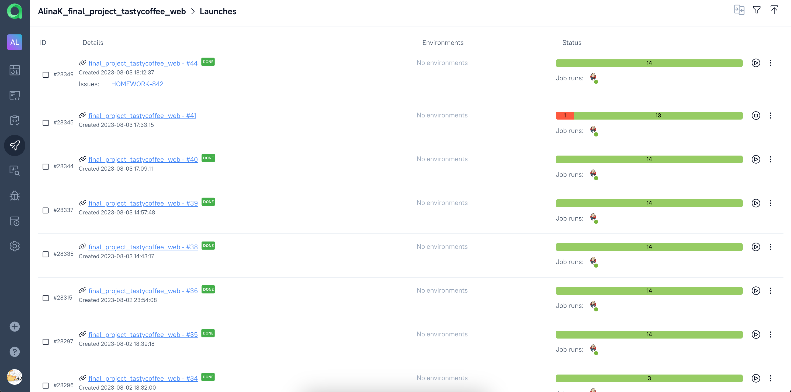
</p>

<a id="jira"></a>
## Интеграция с <a target="_blank" href="https://jira.autotests.cloud/browse/HOMEWORK-842"> Jira </a>
<p align="center">
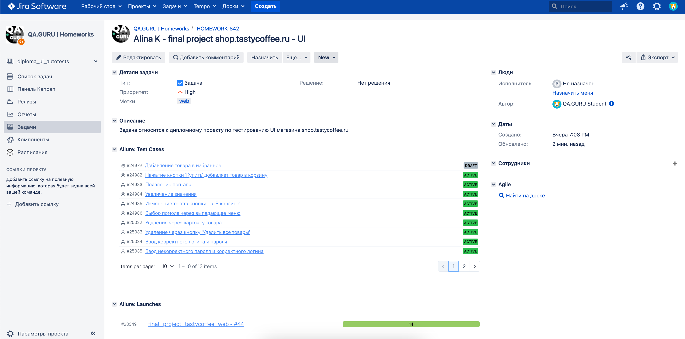
</p>

<a id="telegram"></a>
## Уведомления в Telegram с использованием бота
<p align="center">
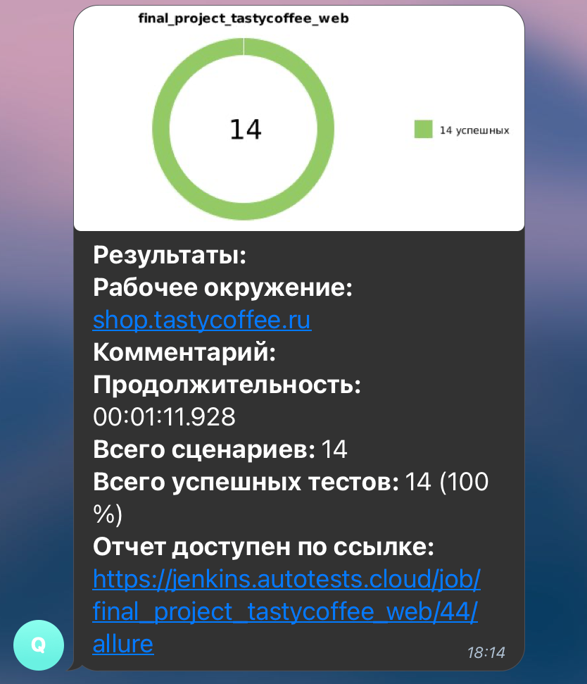
</p>

<a id="video"></a>
## Пример прогона теста в Selenoid. Параметризованный тест на редактирование аватара пользователя

<p align="center">
  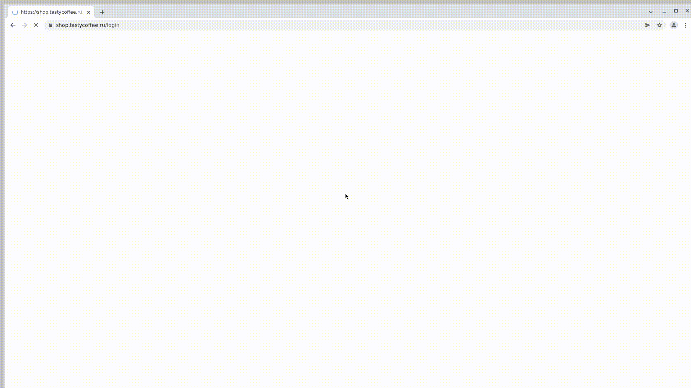
</p>
